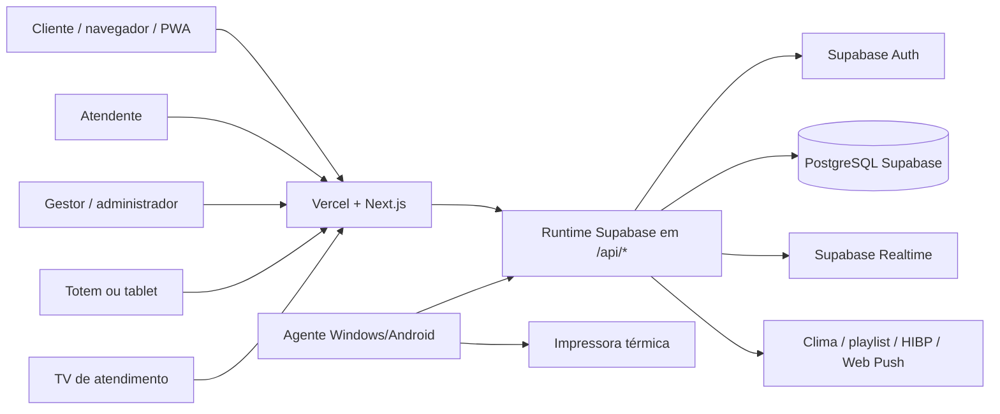

# SenhaHub — Projeto completo

> Documento de visão geral do sistema de filas do Supermercado Pompeia.
>
> Atualizado a partir do código e da documentação do repositório em 20/09/2026.

## 1. O que é o SenhaHub

O SenhaHub é uma plataforma de gerenciamento de filas para atendimento em setores de supermercado. O cliente pode solicitar uma senha pelo celular, tablet ou Totem, acompanhar a posição em tempo real e receber avisos quando estiver próximo ou for chamado.

Ao mesmo tempo, a equipe opera as filas em um painel de atendente, enquanto gestores e administradores acompanham métricas, configuram setores, controlam usuários e administram Totens e impressoras.

O sistema foi criado para atender operações físicas com setores como Açougue, Frios e Padaria, contemplando atendimento normal, atendimento preferencial, emissão de senhas físicas, QR Code individual e integração com impressoras térmicas.

## 2. Situação atual

### Operação oficial

O caminho oficial documentado para produção é:

```text
Navegador/PWA
    ↓ HTTPS
Vercel + Next.js
    ↓ /api/*
Runtime Supabase
    ├── Supabase Auth
    ├── PostgreSQL/Supabase
    ├── RPCs transacionais
    ├── RLS
    └── Realtime
```

Os dispositivos de impressão Windows acessam o domínio HTTPS da aplicação e enviam os trabalhos para a fila persistente do Supabase. A chave administrativa do Supabase permanece somente no servidor.

### Modos preservados no repositório

- **PostgreSQL local:** modo self-hosted para uma futura instalação dentro da loja, com API local, proxy HTTPS, tarefas do Windows/systemd, backup e restauração.
- **SQLite:** compatibilidade de desenvolvimento, testes e partes legadas do runtime local.
- **Agente Android:** alternativa para hardware Android/Bluetooth; os equipamentos atuais substitutos dos tablets usam agentes Windows x86.
- **Arquitetura local + nuvem:** proposta futura para tornar a operação local independente da internet e usar a nuvem como camada analítica. Ela está descrita em `docs/ARQUITETURA_LOCAL_NUVEM.md` e não deve ser confundida com a operação oficial atual.

## 3. Objetivos do produto

1. Reduzir filas físicas e melhorar a experiência do cliente.
2. Permitir que o cliente acompanhe sua senha sem permanecer em frente ao balcão.
3. Dar aos atendentes uma operação simples e atualizada em tempo real.
4. Evitar chamadas simultâneas do mesmo cliente em setores diferentes.
5. Oferecer emissão física confiável, idempotente e auditável.
6. Dar aos gestores visibilidade sobre filas, atendimento, satisfação e impressão.
7. Manter autenticação, autorização, auditoria e recuperação operacional adequadas ao ambiente de supermercado.

## 4. Módulos e perfis

| Módulo | Público | Responsabilidade |
|---|---|---|
| Aplicativo do cliente | Cliente | Solicitar, acompanhar, confirmar, cancelar e avaliar senhas. |
| Login e conta | Todos os usuários autenticados | Login, cadastro de cliente, troca, recuperação e redefinição de senha. |
| Painel do atendente | Atendente | Ver setores permitidos, chamar a próxima senha, controlar atendimento e pular senhas. |
| Painel administrativo | Gestor e administrador | Métricas, operação, setores, Totens, impressão, usuários e permissões. |
| Totem | Cliente no supermercado | Emitir uma ou mais senhas físicas, normal ou preferencial, com QR Code. |
| Tablet | Cliente ou operador autorizado | Solicitar senha digital/física de um fluxo específico, como Açougue da Loja 2. |
| TV de atendimento | Operação e clientes na loja | Exibir chamadas de senha, setor, clima e conteúdo configurado. |
| Agente de impressão | Computador Windows/Android | Consumir a fila, escrever na impressora térmica e confirmar o resultado. |
| PWA e Web Push | Cliente | Instalação no dispositivo, notificações e experiência de acompanhamento. |

### Perfis de acesso

- `customer`: cliente; acessa suas senhas e recursos do aplicativo.
- `attendant`: atendente; opera apenas os setores autorizados.
- `manager`: gestor; possui acesso operacional amplo e pode administrar recursos permitidos.
- `admin`: administrador; possui acesso administrativo total.
- `tablet`: perfil técnico/operacional para o fluxo do tablet.
- `tv`: perfil restrito para a tela de atendimento.

As permissões de atendentes podem ser limitadas por setor. O isolamento por loja e setor também é aplicado no banco e nas regras do runtime.

## 5. Jornadas principais

### 5.1 Cliente no aplicativo

1. O cliente entra em `/login` ou acessa o aplicativo.
2. Faz login ou cria uma conta de cliente.
3. O navegador mantém a identificação da sessão e do dispositivo.
4. O cliente escolhe um ou mais setores e o tipo de atendimento.
5. O backend emite a senha e grava o estado no banco.
6. O cliente acompanha número atual, posição, setor e status.
7. O cliente recebe atualização em tempo real e pode receber Web Push.
8. Ao ser chamado, confirma a presença, inicia o atendimento quando aplicável e avalia a experiência ao final.

O cliente pode recuperar suas senhas ativas após atualizar a página. O limite padrão documentado é de três senhas ativas por cliente.

### 5.2 Totem físico

1. O Totem é aberto em `/totem`.
2. Um gestor pareia o equipamento quando necessário.
3. O Totem pode operar em modo central, permitindo escolher o setor, ou em modo específico, fixado em um setor.
4. O cliente escolhe atendimento normal ou preferencial.
5. Pode selecionar um ou mais setores no mesmo pedido.
6. O backend cria as senhas e os trabalhos de impressão em uma operação idempotente.
7. O resultado apresenta os números, o QR Code individual ou do conjunto e o link de acompanhamento.
8. O agente de impressão retira o trabalho, imprime o cupom e confirma o resultado.

### 5.3 Atendente

1. O atendente entra em `/attendant`.
2. O painel carrega somente os setores autorizados.
3. O atendente chama a próxima senha elegível.
4. O cliente é avisado no aplicativo, por notificação e pela TV quando configurada.
5. O atendente confirma, inicia ou finaliza o atendimento.
6. Se necessário, pula a senha com um motivo operacional registrado.

As atualizações do painel são recebidas por Server-Sent Events (`SSE`) em `/api/events?scope=staff`, com carregamento de estado como reconciliação.

### 5.4 Gestor e administrador

O painel administrativo é dividido em:

- `/admin`: visão geral e métricas;
- `/admin/operacao`: operação em tempo real;
- `/admin/setores`: configuração de setores, balcões, fila e capacidade;
- `/admin/totens`: Totens, impressoras e revisão de trabalhos;
- `/admin/usuarios`: usuários, perfis e permissões por setor.

O gestor/admin também pode consultar observabilidade operacional em `/api/observability`, incluindo execuções do Cron e indicadores da fila de impressão.

### 5.5 Acompanhamento por QR Code

Cada senha física recebe um token individual de acompanhamento. O QR Code aponta para:

```text
/acompanhar/<token>
```

A tela consulta o backend sem expor a senha completa ou credenciais administrativas, mostra o estado da fila e permite abrir a experiência de notificação/vibração do dispositivo.

### 5.6 TV de atendimento

A rota `/tv/acougue` exibe chamadas de senha para a operação do Açougue. A tela pode consultar estado de exibição, clima e playlist configurada. O acesso é restrito por autenticação/perfil apropriado.

## 6. Regras de negócio da fila

### Estados das senhas

Os estados principais são:

```text
aguardando → proximo → chamado → em_atendimento → atendido
                    │          │
                    ├──────────┴→ standby
                    └────────────→ espera_inteligente

aguardando/proximo/chamado/standby → cancelado ou expirado
```

Os estados usados pelo runtime incluem:

- `aguardando`: aguardando chamada;
- `proximo`: elegível/próxima senha;
- `chamado`: chamada realizada, aguardando confirmação;
- `em_atendimento`: atendimento iniciado;
- `espera_inteligente`: temporariamente bloqueada por outro atendimento do mesmo cliente;
- `standby`: aguardando nova ação dentro da janela operacional;
- `atendido`: atendimento concluído;
- `cancelado`: cancelamento registrado;
- `expirado`: senha encerrada por ausência ou expiração.

### Orquestração inteligente

O sistema evita que o mesmo cliente seja chamado ao mesmo tempo em mais de um setor. Para isso, usa a identidade do cliente, do dispositivo e as senhas ativas. Se o cliente já estiver `chamado` ou `em_atendimento` em outro setor, a nova senha pode entrar em `espera_inteligente`.

Quando o atendimento que bloqueava a fila termina, o sistema libera somente a próxima senha protegida elegível.

### Preferência

O modelo contempla atendimento preferencial e categorias como pessoa idosa, gestante/lactante, deficiência ou mobilidade reduzida, TEA, criança de colo, obesidade e outras categorias cadastradas no runtime.

### Ausência e standby

Uma senha chamada sem confirmação pode ser reagendada uma vez, conforme as regras de ausência. Depois de nova ausência, pode expirar. O sistema também registra `standby` e a janela de expiração para não deixar a fila presa indefinidamente.

### Idempotência e concorrência

- O Totem usa uma chave idempotente por escopo para evitar duas emissões do mesmo pedido.
- A chamada da próxima senha é protegida por RPC/transação para evitar que dois atendentes retirem a mesma senha.
- A impressão v2 usa `requestId`, lease, versão de tentativa e confirmação idempotente.
- O estado persistido é a fonte de verdade; eventos em tempo real são sinais de atualização, não a única fonte de decisão.

## 7. Arquitetura técnica atual

### Componentes



### Frontend

O frontend usa Next.js App Router como shell de páginas e mantém várias interações em HTML, CSS e JavaScript Vanilla. As páginas Next carregam templates de `public/` por meio do componente `HtmlTemplate` e inicializam os scripts específicos de cada tela.

Tecnologias principais:

- Next.js `16.3.4`;
- React `19.2.6`;
- JavaScript e JSX;
- CSS próprio em `public/styles.css` e `public/pwa.css`;
- Service Worker em `public/sw.js`;
- Web App Manifest gerado em `app/manifest.js`;
- fonte Inter carregada no layout;
- QR Code por `public/vendor/qrcode-generator.js`.

### Backend

O runtime oficial para Vercel está em `server/integrations/supabase-runtime.js` e é exposto por `app/api/[...path]/route.js`. Essa rota aceita `GET`, `POST`, `PUT` e `DELETE`, é dinâmica e executa em Node.js.

O servidor customizado `server/server.js` preserva o modo standalone, o backend SQLite e as rotas PostgreSQL local. Ele também concentra tarefas de manutenção, saúde, SSE e compatibilidades locais.

### Dados e transações

As operações críticas usam Supabase e RPCs transacionais, incluindo:

- emissão digital e física de senha;
- chamada da próxima senha;
- confirmação e finalização;
- claim de trabalho de impressão;
- início, renovação, conclusão e recuperação de lease;
- resolução administrativa de impressão;
- manutenção e reset controlado do histórico.

As chaves `SUPABASE_SERVICE_ROLE_KEY`, `AUTH_SECRET`, `CRON_SECRET`, VAPID privado e segredos de impressão nunca devem ser enviados ao navegador ou versionados.

## 8. Rotas de produto

| Rota | Uso |
|---|---|
| `/` | Aplicativo principal do cliente. |
| `/login` | Login, cadastro, troca e recuperação de senha. |
| `/acompanhar/<token>` | Acompanhamento público/individual de uma senha por token. |
| `/attendant` | Painel de atendimento. |
| `/admin` | Visão geral administrativa. |
| `/admin/operacao` | Operação em tempo real. |
| `/admin/setores` | Setores e configuração operacional. |
| `/admin/totens` | Totens, impressoras e trabalhos. |
| `/admin/usuarios` | Usuários e permissões. |
| `/totem` | Emissão física de senhas. |
| `/tablet` | Emissão pelo fluxo de tablet. |
| `/tv/acougue` | TV de chamadas do Açougue. |
| `/instalar` | Orientação de instalação do PWA. |

## 9. API por grupos

### Saúde e configuração

- `GET /api/health`: liveness da aplicação.
- `GET /api/ready`: readiness e confirmação do backend Supabase.
- `GET /api/config`: configuração pública limitada.
- `GET /api/internal/jobs`: rotina interna protegida pelo `CRON_SECRET`.
- `GET /api/observability`: observabilidade para gestor/admin.

### Autenticação

- `POST /api/auth/login`
- `POST /api/auth/logout`
- `GET /api/auth/me`
- `POST /api/auth/register`
- `POST /api/auth/change-password`
- `POST /api/auth/forgot-password`
- `POST /api/auth/reset-password`
- `POST /api/auth/mfa/verify`
- `POST /api/auth/mfa/cancel`

### Fila e atendimento

- `POST /api/sessions`
- `GET /api/state`
- `GET /api/history`
- `GET /api/events`
- `GET /api/staff/state`
- `GET /api/display/state`
- `GET /api/metrics`
- `POST /api/tickets`
- `GET /api/tickets/track/<token>`
- `POST /api/tickets/<id>/confirm`
- `POST /api/tickets/<id>/finish`
- `POST /api/tickets/<id>/skip`
- `POST /api/tickets/<id>/cancel`
- `POST /api/sectors/<id>/call-next`
- `POST /api/sectors/<id>/call-control`
- `PUT /api/sectors/<id>`
- `POST /api/ratings`
- `POST /api/tickets/history/reset`

### Usuários e setores

- `GET /api/users`
- `POST /api/users`
- `PUT /api/sectors/<id>`

### Totem, tablet e impressão

- `GET /api/kiosk/status`
- `POST /api/kiosk/pair`
- `POST /api/kiosk/unpair`
- `POST /api/kiosk/tickets`
- `GET /api/kiosk/print-jobs/<id>`
- `GET /api/tablet/status`
- `POST /api/tablet/tickets`
- `GET /api/tablet/print-jobs/<id>`
- `POST /api/print/jobs/claim`
- `POST /api/print/jobs/<id>/finish`
- `POST /api/print/realtime-config`
- `POST /api/print/heartbeat`

O protocolo v2 também possui endpoints de bootstrap, enrollment, claim, recover, start, renew, finish, events e resolve em `/api/print/v2/...`.

### Notificações e integrações

- `GET /api/push/status`
- `POST /api/push/subscribe`
- `DELETE /api/push/unsubscribe`
- `PATCH /api/push/preferences`
- `POST /api/push/test`
- `GET /api/weather`
- `GET /api/instagram/video`

## 10. Modelo de dados

As migrations em `supabase/migrations/` são a referência do schema. As principais entidades são:

| Tabela/entidade | Finalidade |
|---|---|
| `auth.users` | Identidades gerenciadas pelo Supabase ou pelo modo local compatível. |
| `public.profiles` | Nome, e-mail, papel, status e loja do usuário. |
| `public.sectors` | Setores, prefixo, balcão, fila, capacidade e status. |
| `public.profile_sector_permissions` | Permissões de usuário por setor. |
| `public.devices` | Dispositivos associados a clientes. |
| `public.tickets` | Senhas, números, status, prioridade, timestamps e vínculos de espera. |
| `public.calls` | Histórico de chamadas e ações do atendente. |
| `public.services` | Início e fim do atendimento. |
| `public.ratings` | Nota e comentário do cliente. |
| `public.events` | Eventos de domínio e auditoria operacional. |
| `public.print_kiosks` | Totens/destinos de impressão. |
| `public.print_printers` | Impressoras físicas registradas. |
| `public.print_devices` | Agentes autorizados a consumir filas. |
| `public.print_jobs` | Fila persistente de trabalhos de impressão. |
| `public.print_job_attempts` | Histórico de tentativas, duração e resultado. |
| `public.print_enrollments` | Códigos temporários de provisionamento. |
| `public.print_signal_failures` | Falhas do sinal de impressão/Reatime. |
| `public.web_push_subscriptions` | Inscrições de navegador para Web Push. |
| `public.push_notification_preferences` | Preferências de notificações. |
| `public.cron_executions` | Histórico de execuções agendadas. |
| `public.security_rate_limits` | Limites de segurança por operação. |
| `public.auth_mfa_challenges` | Estrutura de desafios MFA preservada para reativação. |

## 11. Segurança

Controles implementados no código e no banco incluem:

- produção aceita API somente por HTTPS;
- HSTS, CSP, `X-Content-Type-Options`, `X-Frame-Options` e `Referrer-Policy`;
- sessão em cookie `HttpOnly`, `Secure` e `SameSite=Strict`;
- proteção CSRF nas mutações;
- validação de origem em rotas sensíveis;
- limites de requisição, login e emissão;
- revogação de sessões;
- RLS e allowlists para acesso do runtime ao Supabase;
- separação entre chaves públicas e administrativas;
- senhas com política mínima de força, bloqueio de escolhas comuns e consulta HIBP por k-anonymity;
- logs estruturados sem imprimir segredos;
- `requestId` para correlacionar requisição, logs e alertas;
- jobs de impressão com lease, tentativas, auditoria e revisão manual para resultado físico desconhecido;
- backups PostgreSQL/Supabase criptografados com AES-256-GCM nos scripts de operação.

### Pontos ainda pendentes

O backlog registra como pendências, entre outras:

- configurar e validar SMTP de produção e os registros SPF, DKIM e DMARC;
- executar backup externo e restauração em ambiente separado;
- reconciliar o histórico remoto de migrations;
- reativar e validar MFA/TOTP nativo para administradores;
- concluir domínio próprio/Cloudflare e proxy confiável;
- concluir o mapa de dados, política e rotinas LGPD;
- validar testes físicos de papel, corte, tampa, falta de papel, queda de rede e reinício;
- executar E2E em Safari/iPhone e Android reais;
- realizar auditoria de acessibilidade e validação PWA/Web Push em dispositivos reais.

O status oficial das tarefas deve ser consultado em `BACKLOG_SENHAHUB.md`.

## 12. PWA, offline e Web Push

O SenhaHub pode ser instalado como PWA. O Service Worker:

- usa cache para assets estáticos;
- usa estratégia de rede para API, login e mutações;
- oferece `offline.html` como fallback de navegação;
- não persiste respostas privadas, cookies ou páginas autenticadas indevidamente;
- informa ao usuário quando há uma nova versão;
- evita recarregar durante uma operação crítica.

O Web Push usa VAPID e inscrição do navegador. O cliente pode ativar/desativar notificações, configurar preferências e remover a inscrição ao sair. A entrega real depende da configuração das chaves VAPID e do suporte do navegador/sistema operacional.

## 13. Impressão térmica

### Protocolo v2

A migration `20260905055534_print_protocol_v2.sql` adiciona o protocolo v2 sem remover automaticamente o v1. O fluxo v2 usa:

- `print_jobs` como verdade durável;
- vínculo entre loja, Totem, dispositivo e impressora;
- `device_id`, `printer_id`, `lease_id` e `attempt_version`;
- leases renováveis;
- histórico em `print_job_attempts`;
- journal local do agente;
- Realtime privado como sinal de acordar o agente;
- reconciliação por watchdog após reconexão ou falha de sinal;
- estado `needs_review` para resultado físico desconhecido;
- resolução administrativa explícita antes de reimprimir.

O agente nunca deve confiar somente no evento Realtime para decidir o que imprimir. Ele sempre reconcilia a fila persistida.

### Agentes e hardware

| Destino | Agente | Impressora/uso |
|---|---|---|
| Totem principal | Windows específico em `windows/print-agent-totem` | Bematech MP-4000 TH FI, com parâmetros seriais próprios. |
| Mini PC de tablet | Windows x86 em `windows/print-agent-x86` | Bematech MP-4200 TH, homologada com `COM4` no equipamento documentado. |
| Agente inicial/legado | `scripts/print-agent.js` e `windows/print-agent` | Compatibilidade com o fluxo ESC/POS anterior. |
| Android alternativo | `android/print-agent` | POS-5890A-L/Bluetooth clássico, somente quando houver hardware Android. |
| Simulador | `scripts/print-simulator.js` | Simula o cupom sem enviar bytes à porta serial. |

Em caso de dúvida sobre o resultado físico, o trabalho deve permanecer em revisão. Não se deve apagar o job ou criar uma nova senha manualmente para destravar a fila.

## 14. Variáveis de ambiente principais

Os valores reais devem ficar em `.env.local`, Vercel Environment Variables ou no gerenciador seguro do host. Nunca coloque segredos neste arquivo.

### Runtime

```text
NODE_ENV
PORT
DATA_BACKEND
SUPABASE_AUTH_ENABLED
SUPABASE_URL
SUPABASE_ANON_KEY
SUPABASE_SERVICE_ROLE_KEY
AUTH_SECRET
CRON_SECRET
PUBLIC_APP_URL
```

### Conta e senha

```text
DEMO_USERS_JSON
BOOTSTRAP_ADMIN_NAME
BOOTSTRAP_ADMIN_EMAIL
BOOTSTRAP_ADMIN_PASSWORD
HIBP_ENABLED
HIBP_TIMEOUT_MS
```

### Totem, tablet e impressão

```text
KIOSK_ID
KIOSK_MODE
KIOSK_SECTOR_ID
KIOSK_PRINTER_PORT
PRINT_AGENT_TOKEN
PRINT_PROVISIONING_SECRET
PRINT_REALTIME_ENABLED
PRINT_RECONCILIATION_MS
PRINT_SERIAL_*
TABLET_PRINTER_*
```

### Web Push e observabilidade

```text
PUSH_NOTIFICATIONS_ENABLED
NEXT_PUBLIC_VAPID_PUBLIC_KEY
VAPID_PRIVATE_KEY
VAPID_SUBJECT
OBSERVABILITY_ALERT_WEBHOOK_URL
```

## 15. Como executar

### Pré-requisitos

- Node.js 22.x;
- npm;
- projeto Supabase configurado para o modo oficial;
- variáveis de ambiente locais.

### Desenvolvimento

```bash
npm install
npm run dev
```

O servidor fica disponível em `http://localhost:3000`.

### Validações principais

```bash
npm run check
npm test
npm run build
npm run preflight:production
```

Para a variante PostgreSQL local:

```bash
npm run preflight:local-postgres
npm run test:postgres
```

Para impressão:

```bash
npm run check:print-agent
npm run test:print-v2
npm run print:simulate
npm run print:agent:ports
npm run print:agent:test
```

## 16. Deploy e operação

### Vercel + Supabase

1. Configure as variáveis de ambiente na Vercel.
2. Aplique as migrations no projeto Supabase correto.
3. Reconcilie o histórico remoto de migrations antes de aplicar migrations individualmente quando necessário.
4. Execute `npm run preflight:production`.
5. Execute `npm run build` e `npm test`.
6. Publique na Vercel.
7. Verifique `/api/health` e `/api/ready`.
8. Monitore logs, Cron, impressão, Realtime e a fila `needs_review`.

O `vercel.json` agenda a rotina interna diariamente às 03:00 UTC para compatibilidade com o plano Hobby registrado na documentação. Os agentes fazem reconciliação própria; um sweep mais frequente exige plano compatível ou scheduler externo autenticado.

### Servidor Windows/PostgreSQL local

Os scripts em `windows/server` instalam a API como tarefa automática, usando PostgreSQL local e acesso por proxy HTTPS. A instalação executa dependências, check, preflight e teste de readiness. O banco não deve ser exposto diretamente à internet.

### Backup e restauração

Os scripts disponíveis são:

- `npm run backup:supabase`;
- `npm run restore:supabase`;
- `npm run backup:postgres`;
- `npm run restore:postgres`;
- `npm run backup:verify`.

O backup deve ser criptografado, armazenado fora do projeto e restaurado periodicamente em uma base separada. Dumps, chaves e URLs de banco não entram no Git.

## 17. Estrutura do repositório

```text
app/                         Rotas Next.js, layout e templates de página
app/api/[...path]/            Entrada da API oficial Supabase
public/                       HTML, CSS, JavaScript, PWA, imagens e assets
server/                       Servidor customizado, auth, runtime local e serviços
server/integrations/          Runtime Supabase e integrações externas
server/kiosk/                 Totem, fila e protocolo de impressão
server/notifications/         Web Push e notificações locais
server/platform/              Observabilidade e readiness
supabase/migrations/          Schema, RLS, RPCs e evoluções do banco
scripts/                      Preflight, backup, testes e agentes de impressão
tests/                        Testes automatizados Node.js
load-test/                    Cenários k6 e consulta de verificação
windows/                      Instaladores e agentes Windows
android/                      Agente Android alternativo
deploy/                       Exemplos de Nginx, systemd e operação local
docs/                         Guias técnicos e relatórios de implantação
```

## 18. Documentação de referência

| Documento | Conteúdo |
|---|---|
| `README.md` | Instalação, variáveis, rotas, comandos e visão rápida. |
| `BACKLOG_SENHAHUB.md` | Único controle de status e pendências. |
| `docs/IMPRESSAO_V2.md` | Protocolo, provisionamento, operação e rollout de impressão. |
| `docs/totem-impressao.md` | Contexto do Totem, parâmetros físicos e agentes. |
| `docs/pwa-web-push.md` | PWA, Service Worker, Web Push e teste manual. |
| `docs/observabilidade.md` | Logs estruturados, Cron, alertas e métricas de impressão. |
| `docs/SEGURANCA_OPERACIONAL.md` | Hardening, backups, DNS, DDoS e checklist operacional. |
| `docs/supabase-setup.md` | Configuração do banco e do Supabase. |
| `docs/PASSO_A_PASSO_SERVIDOR_WINDOWS.md` | Instalação do servidor local no Windows. |
| `docs/ARQUITETURA_LOCAL_NUVEM.md` | Proposta de arquitetura híbrida futura. |
| `docs/RELATORIO_IMPLANTACAO_CONTROLADA_2026-09-05.md` | Registro da implantação controlada do protocolo v2. |
| `docs/INOVASKILL_VALIDACAO.md` | Demonstração técnica e validação do produto. |
| `docs/projeto.json` | Inventário anterior do protótipo e regras históricas. |

## 19. Qualidade e validação já cobertas

O repositório possui testes para:

- orquestração da fila;
- autenticação, sessão, papéis e senha;
- segurança e regressões;
- ciclo de vida de tickets;
- impressão v1/v2, SQLite e PostgreSQL;
- concorrência e idempotência;
- PWA e Web Push;
- observabilidade;
- vibração e acompanhamento;
- readiness e produção.

O relatório de implantação controlada registra, em seu respectivo momento, build Vercel aprovado, checks sintáticos aprovados, testes de impressão aprovados e validação automatizada do módulo Android. Testes físicos de impressora, papel, Bluetooth, queda de energia e dispositivos reais continuam sendo validações de campo e devem ser repetidos quando o hardware ou a configuração mudar.

## 20. Próximos passos de maior impacto

O backlog centralizado deve ser a fonte oficial. Em termos de produto e operação, os próximos blocos mais relevantes são:

1. concluir a infraestrutura local/híbrida e o plano de continuidade;
2. validar impressão física contínua, recuperação após falhas e operação durante um turno real;
3. configurar SMTP, recuperação de senha em produção, backup externo e restauração ensaiada;
4. reativar e validar MFA administrativo;
5. completar o refinamento de setores, permissões e regras de fechamento;
6. concluir a migração visual para a identidade laranja do VR Software;
7. executar acessibilidade, E2E em dispositivos reais e validação final do PWA/Web Push;
8. finalizar os itens de privacidade e LGPD.

## 21. Regra de manutenção desta documentação

Este arquivo descreve arquitetura, funcionamento e limites do projeto. O status de tarefas deve ser alterado somente em `BACKLOG_SENHAHUB.md`.

Ao fazer uma mudança relevante:

1. atualizar o documento técnico específico do módulo;
2. atualizar este panorama se a arquitetura, uma rota, um perfil ou um fluxo mudar;
3. registrar a tarefa ou a pendência no backlog;
4. executar os checks adequados antes do deploy;
5. não registrar segredos, tokens, senhas, chaves privadas ou dumps neste arquivo.


Escanear o qrcode no tablet
Mouse na tela da tv
Decritivo na impressao
Vibraçao ativada
Hardware funcionando
Tela vr 
Adesivo 

