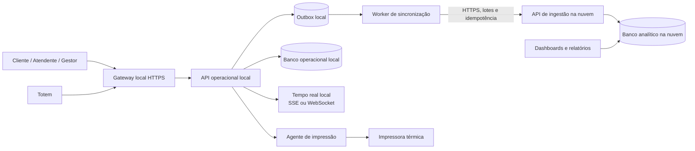

# Arquitetura local + nuvem do SenhaHub

**Status:** proposta inicial para discussão  
**Escopo desta etapa:** documentação apenas; nenhum código, banco ou configuração do SenhaHub deve ser alterado.

## 1. Objetivo

Reconstruir a infraestrutura do SenhaHub com duas camadas bem separadas:

- **Local:** fonte oficial da operação. Todas as requisições operacionais chegam ao servidor local.
- **Nuvem:** camada analítica. Recebe dados produzidos pelo local e disponibiliza dashboards e relatórios.

A nuvem não deve ser necessária para emitir, chamar, acompanhar ou finalizar uma senha. Se a conexão com a internet cair, a loja deve continuar operando localmente e sincronizar os dados depois.

## 2. Decisões arquiteturais

### 2.1 Fonte de verdade

O banco local é o **sistema de registro oficial** para:

- usuários, sessões e permissões;
- setores, balcões, totens e dispositivos;
- clientes e senhas;
- chamadas, atendimentos e finalizações;
- cancelamentos, ausências e avaliações;
- fila de impressão;
- auditoria operacional.

O banco da nuvem é uma **projeção para leitura**. Ele pode ter atraso, mas nunca deve decidir o estado atual da fila.

### 2.2 Direção dos dados

O fluxo de negócio é sempre iniciado no local:



### 2.3 Regra de roteamento

| Origem | Destino obrigatório | Observação |
|---|---|---|
| Aplicativo do cliente | API local | Emissão e acompanhamento de senha são locais. |
| Painel do atendente | API local | Chamar, iniciar, pausar, pular e finalizar são operações locais. |
| Painel administrativo operacional | API local | Setores, usuários, totens e configurações operacionais ficam locais. |
| Totem | API local | A emissão física não depende da nuvem. |
| Agente de impressão | API local | Busca e confirma trabalhos apenas no servidor local. |
| Worker de sincronização | API de ingestão na nuvem | É uma integração de saída; não é uma chamada da interface. |
| Dashboard na nuvem | Banco/API analítico da nuvem | Somente leitura, sem executar comandos operacionais. |

## 3. Componentes da infraestrutura local

### 3.1 Gateway local

Responsabilidades:

- terminar HTTPS;
- encaminhar as rotas para a API local;
- aplicar limites básicos de requisição;
- disponibilizar `/health` e `/ready`;
- não acessar diretamente o banco.

O gateway deve ser o único ponto exposto na rede. O banco, o worker e os serviços internos devem aceitar conexões somente da rede local ou da própria máquina.

### 3.2 API operacional local

É o núcleo do sistema. Deve concentrar:

- regras da fila;
- autenticação e autorização;
- transações do banco;
- eventos em tempo real;
- integração com totens e impressoras;
- auditoria;
- criação dos eventos de sincronização.

Nenhuma tela deve escrever diretamente no banco local ou no banco da nuvem.

### 3.3 Banco operacional local

Para a reconstrução, a recomendação é utilizar **PostgreSQL local** como banco principal. O SQLite atual pode continuar sendo referência de desenvolvimento, mas não deve ser o alvo da infraestrutura definitiva porque a nova operação terá concorrência entre clientes, atendentes, totens e agentes.

Características esperadas:

- volume persistente separado do código;
- transações e bloqueios adequados para emissão/chamada de senhas;
- WAL e política de retenção de logs;
- backup local automatizado;
- restauração testada periodicamente;
- relógio do servidor sincronizado;
- acesso restrito por rede e credenciais de serviço.

### 3.4 Outbox de sincronização

Cada mudança que precisa aparecer nos dashboards deve gravar, na mesma transação da operação, um registro na outbox local.

Exemplo:

```text
transação local
  ├─ atualiza tickets
  ├─ grava ticket_event
  └─ grava outbox_event = pendente
```

O worker pode tentar enviar o mesmo evento várias vezes. A nuvem deve aceitar o evento uma única vez por `event_id` e responder com confirmação somente depois de persistir o lote.

### 3.5 Worker de sincronização

Responsabilidades:

- ler eventos pendentes em ordem de criação;
- agrupar eventos em lotes pequenos;
- enviar os lotes à API de ingestão;
- repetir com backoff quando a nuvem estiver indisponível;
- registrar tentativas, respostas e último erro;
- marcar como sincronizado somente após confirmação;
- permitir reprocessamento de um intervalo sem duplicar dados.

O worker não deve bloquear a API operacional. A fila local precisa continuar funcionando mesmo que a outbox cresça temporariamente.

## 4. Componentes da nuvem

### 4.1 API de ingestão

É uma entrada técnica para dados enviados pelo local, não uma API pública do SenhaHub.

Deve oferecer apenas operações como:

- receber lote de eventos;
- validar a instalação/loja de origem;
- validar assinatura e versão do contrato;
- aplicar idempotência;
- persistir o evento bruto;
- atualizar o modelo analítico;
- devolver os eventos aceitos e rejeitados.

Não deve oferecer rotas para chamar senha, criar atendimento, alterar setor ou alterar usuário.

### 4.2 Banco analítico

O banco da nuvem deve ser otimizado para leitura e agregações. Ele não precisa reproduzir todas as tabelas operacionais do local.

Uma primeira separação possível:

| Camada | Exemplos |
|---|---|
| Eventos brutos | `ingestion_batches`, `ingestion_events` |
| Dimensões | `dim_stores`, `dim_sectors`, `dim_users`, `dim_devices`, `dim_calendar` |
| Fatos | `fact_tickets`, `fact_calls`, `fact_services`, `fact_ratings`, `fact_print_jobs` |
| Agregados | `daily_store_metrics`, `hourly_queue_metrics`, `sector_performance` |

Os eventos brutos devem ser preservados por um período definido para auditoria e reconstrução dos agregados. Os agregados podem ser recalculados sem tocar na operação local.

### 4.3 Dashboards

Os dashboards devem consultar somente o modelo analítico. Exemplos:

- volume de senhas por período;
- tempo médio de espera;
- tempo médio de atendimento;
- abandono e ausência;
- desempenho por setor e faixa horária;
- satisfação;
- falhas e tempo de impressão;
- saúde da sincronização;
- comparação entre lojas, quando houver mais de uma instalação.

O dashboard deve indicar o horário do último evento recebido e o atraso estimado da sincronização.

## 5. Modelo de sincronização

### 5.1 Evento mínimo

Todo evento enviado à nuvem deve conter pelo menos:

```json
{
  "event_id": "uuid-estavel",
  "store_id": "loja-01",
  "event_type": "ticket.finished",
  "aggregate_type": "ticket",
  "aggregate_id": "ticket-123",
  "occurred_at": "2026-08-19T12:00:00.000Z",
  "sequence": 12345,
  "schema_version": 1,
  "payload": {}
}
```

Regras:

- `event_id` nunca muda e identifica a operação de sincronização;
- `sequence` é monotônica por loja e ajuda a detectar lacunas;
- `occurred_at` é o momento da operação no servidor local, não o momento do envio;
- `schema_version` permite evoluir o contrato sem quebrar instalações antigas;
- o `payload` deve conter somente os campos necessários para os dashboards;
- senhas, tokens de sessão, chaves e credenciais nunca entram no evento.

### 5.2 Eventos iniciais

- `ticket.created`
- `ticket.called`
- `ticket.confirmed`
- `ticket.service_started`
- `ticket.finished`
- `ticket.skipped`
- `ticket.canceled`
- `ticket.expired`
- `rating.created`
- `print_job.created`
- `print_job.printed`
- `print_job.failed`
- `sector.updated`
- `user.status_changed`
- `sync.health_reported`

O estado operacional continua sendo lido do banco local. Eventos são o contrato de integração e a base para reconstruir os indicadores.

### 5.3 Comportamento em falhas

| Falha | Comportamento esperado |
|---|---|
| Internet indisponível | Operação local continua; eventos ficam pendentes na outbox. |
| API de ingestão indisponível | Worker tenta novamente com backoff; nenhum evento é descartado. |
| Evento duplicado | Nuvem reconhece `event_id` já recebido e não duplica o fato. |
| Lacuna de sequência | Nuvem sinaliza a loja e mantém o lote posterior aguardando ou marcado para reconciliação. |
| Banco analítico indisponível | Ingestão falha de forma explícita; o local continua operando. |
| Servidor local indisponível | Operação fica indisponível; dashboard mostra o último horário sincronizado. |
| Erro de contrato | Evento fica rejeitado com motivo; worker não deve apagar o original. |

## 6. Limites de responsabilidade

### Permanece exclusivamente no local

- estado atual da fila;
- escolha da próxima senha;
- regras de espera inteligente;
- autenticação operacional;
- permissões de atendentes e gestores;
- emissão do totem;
- impressão;
- alterações de setores e configurações;
- dados necessários para o atendimento continuar sem internet.

### Pode ser enviado para a nuvem

- identificadores técnicos pseudonimizados;
- loja, setor e dispositivo;
- horários de emissão, chamada, confirmação e finalização;
- status finais e motivos operacionais;
- tempos calculados ou calculáveis;
- avaliações agregáveis;
- falhas e duração de impressão;
- estado da sincronização.

### Não deve ser enviado para a nuvem por padrão

- senhas de usuários;
- cookies e tokens de sessão;
- chaves de serviço;
- localização precisa do cliente;
- dados pessoais que não sejam necessários para o relatório;
- payloads de autenticação ou MFA.

## 7. Segurança

- O banco local nunca fica acessível diretamente pela internet.
- O banco analítico nunca aceita comandos operacionais.
- A comunicação local → nuvem usa HTTPS.
- Cada loja/instalação tem uma credencial própria de sincronização.
- A credencial do worker é diferente da credencial do agente de impressão.
- A autenticação do dashboard é independente da sessão operacional local.
- O navegador nunca recebe credenciais administrativas de banco.
- Toda ação operacional sensível gera auditoria local.
- O gateway e o servidor devem ter firewall e portas mínimas abertas.
- Totens e impressoras devem ficar em rede ou VLAN restrita quando a infraestrutura permitir.
- Backups devem ser criptografados e testados por restauração, sem compartilhar a chave com o sistema de sincronização.

## 8. Disponibilidade e backup

O servidor local é um ponto crítico da loja. A infraestrutura mínima deve prever:

- nobreak para servidor e rede;
- inicialização automática dos serviços após reinício;
- monitoramento local de saúde;
- backup do banco em disco diferente do disco principal;
- cópia externa/fora do servidor;
- retenção diária, semanal e mensal definida;
- teste de restauração documentado;
- alerta quando o espaço do disco, o banco ou a outbox atingir limite;
- procedimento de contingência para emissão manual se o servidor ficar indisponível.

O dashboard deve diferenciar claramente:

1. operação local saudável;
2. operação local saudável, porém sem sincronização;
3. servidor local indisponível e dados do dashboard desatualizados.

## 9. Estrutura lógica sugerida

```text
infra/
  local/
    gateway/
    api-operacional/
    postgres/
    sync-worker/
    observabilidade/
    backups/
  cloud/
    ingest-api/
    analytics-db/
    dashboards/
    observabilidade/
docs/
  ARQUITETURA_LOCAL_NUVEM.md
  CONTRATO_EVENTOS.md
  MODELO_DADOS_LOCAL.md
  MODELO_ANALITICO_NUVEM.md
  OPERACAO_E_CONTINGENCIA.md
```

Essa estrutura é conceitual. Ela não deve ser criada no código nesta etapa; serve apenas para orientar as próximas decisões.

## 10. Sequência de construção

### Fase 0 — Contrato e inventário

- validar os fluxos que realmente precisam continuar funcionando sem internet;
- fechar o catálogo de entidades e estados da fila;
- separar dados operacionais, dados de auditoria e dados analíticos;
- definir os indicadores que os dashboards precisam calcular;
- definir retenção e tratamento de dados pessoais.

### Fase 1 — Banco local definitivo

- desenhar o novo modelo PostgreSQL local;
- definir chaves, índices, transações e auditoria;
- definir migração/importação do legado;
- testar concorrência de emissão, chamada e finalização.

### Fase 2 — API e operação local

- apontar os fluxos operacionais para o servidor local;
- validar cliente, atendente, gestor, totem e impressão;
- validar atualização em tempo real;
- validar funcionamento sem internet.

### Fase 3 — Outbox e sincronização

- registrar eventos junto com as transações locais;
- criar o worker com reprocessamento e idempotência;
- criar a API de ingestão;
- testar queda de rede, duplicidade e lacunas.

### Fase 4 — Modelo analítico e dashboards

- criar o banco de leitura da nuvem;
- construir dimensões, fatos e agregados;
- exibir atraso e saúde da sincronização;
- validar os números contra o banco local.

### Fase 5 — Corte controlado

- operar em paralelo somente para comparação de métricas;
- reconciliar divergências;
- definir o procedimento de rollback;
- promover o local como fonte oficial;
- manter a nuvem sem rotas de escrita operacional.

## 11. Decisões que ainda precisam ser fechadas

1. O servidor local será um computador dedicado, mini-PC, servidor rack ou máquina virtual?
2. Qual será a política de retenção de dados pessoais e eventos?
3. Qual provedor hospedará a API de ingestão, o banco analítico e os dashboards?
4. A nuvem será multi-loja desde o primeiro dia ou começará com uma única loja?
5. Qual janela máxima de atraso dos dashboards é aceitável?
6. Qual é o procedimento de contingência quando o servidor local parar?

## 12. Regra de ouro

> A operação deve sobreviver sem a nuvem. A nuvem deve sobreviver sem comandar a operação.

Esta regra deve ser usada para avaliar qualquer nova funcionalidade, integração ou escolha de banco.
